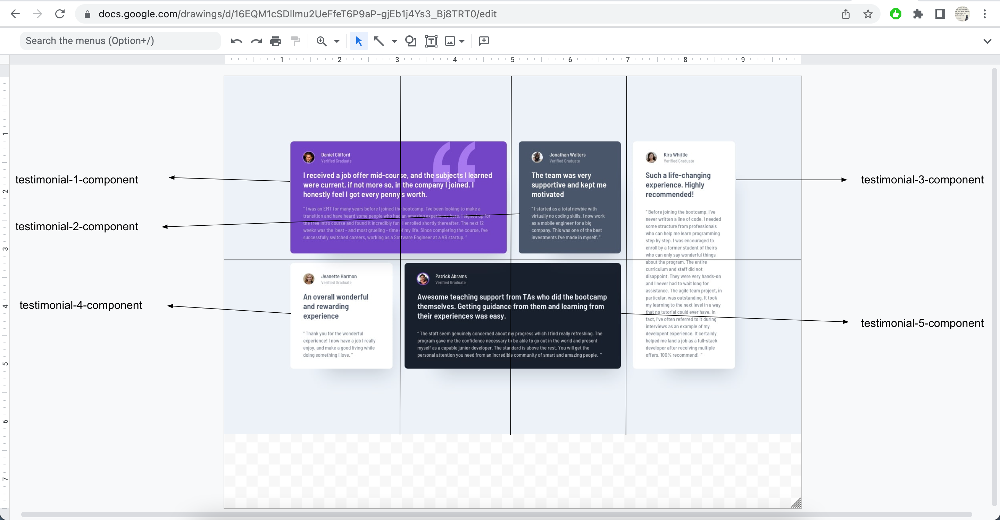
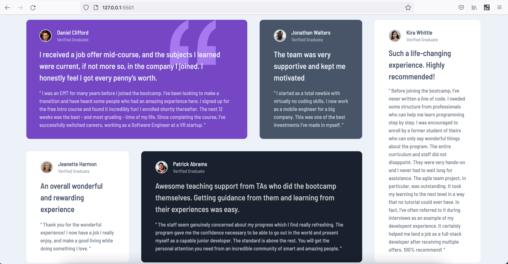
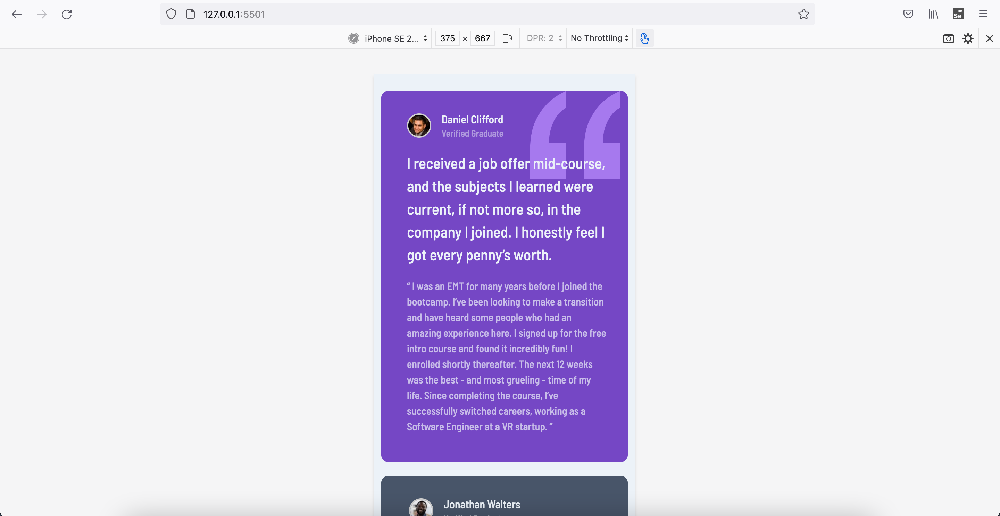

# Frontend Mentor - Testimonials grid section solution

This is a solution to the [Testimonials grid section challenge on Frontend Mentor](https://www.frontendmentor.io/challenges/testimonials-grid-section-Nnw6J7Un7). Frontend Mentor challenges help you improve your coding skills by building realistic projects.

## Table of contents

- [Overview](#overview)
  - [The challenge](#the-challenge)
  - [Screenshot](#screenshot)
  - [Links](#links)
- [My process](#my-process)
  - [Built with](#built-with)
  - [What I learned](#what-i-learned)
  - [Continued development](#continued-development)
  - [Useful resources](#useful-resources)
- [Author](#author)
- [Acknowledgments](#acknowledgments)

## Overview

This is _15th project_ from "Frontend Mentor" to sharpen HTML & CSS skills along with responsive web design and it's build with "BEM", "Grid & Flexbox layout", "min-width, max-width, width in various units & with help of Google ofcourse".

### The challenge

Users should be able to:

- View the optimal layout for the site depending on their device's screen size

### Screenshot

### Links

- [Live Website](https://vikramvi.github.io/Testimonials-grid-section/)

## My process

### Built with

- Semantic HTML5 markup
- BEM
- Mobile-first workflow
- CSS Grid
- Flexbox
- min-width, max-width & width in various units
- Chrome and FF Dev Tools
- Googling

### What I learned

- Improving Googling techniques
- Better dev tool usage on both FF and Chrome
- Better debugging
- Different problem solving techniques

### Continued development

- Learn more about better practices wrt below

  - Grid, Flexbox layouts
  - Mobile layout designs
  - width, max-width, min-width good practices
  - padding, margin good practices
  - SEO and Accessibility practices
  - BEM
  - Responsive Web Design optimum techniques

### Useful resources

- Frontend Mentor slack community + website
- YT videos
- Google
- Stackoverflow

## Author

- Frontend Mentor - [@vikramvi](https://www.frontendmentor.io/profile/vikramvi)

## Acknowledgments

- Frontend Mentor slack community
- YT content creators
- Google + SO community
